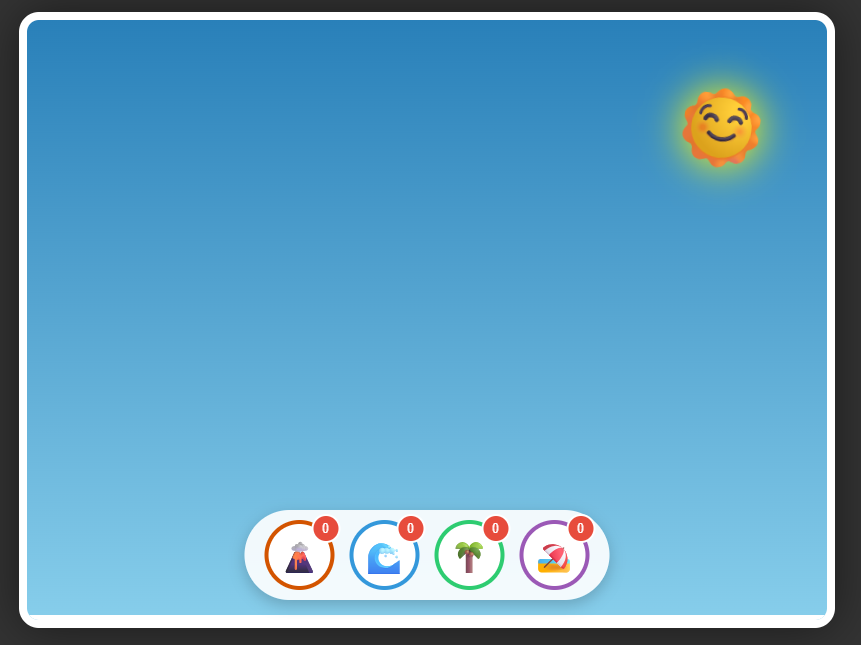

# 🏝️ Island Grow - Flash Style Puzzle


**Island Grow** es un juego de lógica y estrategia web inspirado en la clásica serie *Grow* (Eyezmaze) y la estética de los juegos Flash de los años 2000. 

El objetivo es simple: Selecciona el orden correcto de los elementos para que interactúen entre sí y evolucionen hasta alcanzar el **Nivel MAX**.




## ✨ Características

Este proyecto fue construido con tecnologías web modernas pero manteniendo el espíritu retro:

- **🎨 Estilo Visual Flash:** Gráficos vectoriales simulados con CSS puro (sin imágenes externas), animaciones "elásticas" y colores vibrantes.
- **🔊 Motor de Audio Procedural:** No utiliza archivos `.mp3`. Todos los efectos de sonido (pasos, mejoras, victoria) son generados en tiempo real usando la **Web Audio API**.
- **⚡ Single File Component:** Todo el juego (Lógica, Diseño, Audio) reside en un único archivo `index.html`. ¡Cero dependencias!
- **🧠 Lógica de Interacción:** Sistema de dependencias donde el crecimiento de un elemento afecta a los demás (ej. la Vegetación necesita Agua y Tierra para crecer).

## 🎮 Cómo Jugar

1. Tienes 4 elementos: **Geología (🌋), Agua (🌊), Flora (🌴) y Civilización (🏖️)**.
2. Haz clic en los botones para activarlos uno por uno.
3. Cada vez que activas un elemento, pasa un turno y todos los elementos activos intentan "crecer".
4. **El orden importa:** Algunos elementos necesitan que otros ya estén en un nivel avanzado para poder evolucionar.
5. Tu misión es encontrar la secuencia exacta para lograr el "Paraíso Perfecto" (Todos los elementos a Nivel 4).

## 🚀 Ejecución Local

No necesitas instalar nada complejo.

### Opción 1: Directo
Simplemente descarga el archivo `index.html` y ábrelo en tu navegador favorito (Chrome, Firefox, Edge).

### Opción 2: Servidor Local (Recomendado para desarrollo)
Si tienes Python instalado:

```bash
# Clona el repositorio
git clone https://github.com/TU_USUARIO/island-grow.git

# Entra a la carpeta
cd island-grow

# Inicia un servidor simple
python -m http.server 8000